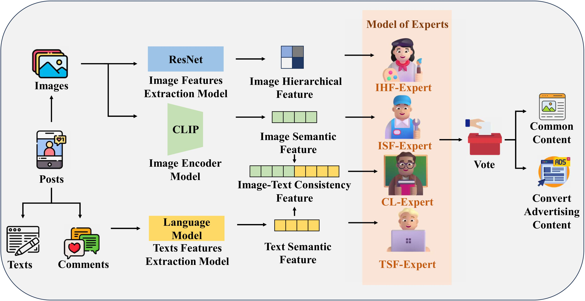

# AdSpectorX: A Multimodal Expert Spector for Covert Advertising Detection on Chinese Social Media

## Overview

<div align=center>
 
</div>


## Dataset

The dataset is located at /dataset/REDNote, which has two directories: 1. the convert_ads_posts directory stores 250 posts that are convert ads in JSON format. 2. the normal_posts directory stores 250 posts that are normal posts in JSON format. Here is an example of normal post's JSON file:

```
{
    "title": "ACL'24大模型通过推理演绎自我学习归纳",
    "description": "论文：《ItD: Large Language Models Can Teach Themselves Induction through Deduction》\n🌟 背景：\n在自然语言处理(NLP)领域，大型语言模型（LLMs）在许多任务上表现出色，但在归纳能力上仍有局限。归纳是从特定观察中发现普遍规律的能力，对智能系统至关重要。尽管LLMs在演绎推理上表现出色，但如何将这种能力转化为归纳学习，仍是一个挑战。\n🎯 贡献：\n本文提出了一种新颖的框架——通过演绎进行归纳（ItD），使LLMs能够利用自身的演绎能力来提升归纳能力。\n我们设计了两个主要组件：\n- 演绎数据生成模块和朴素贝叶斯归纳模块，通过实证结果展示了ItD在两个归纳基准测试上的显著性能提升。\n\n🛠️ 方法：\n- ItD框架首先通过演绎数据生成模块，利用LLMs的演绎能力生成任务数据。\n- 提出了朴素贝叶斯归纳策略，优化了每个样本的使用，并能够利用观察样本数量的增加。这种方法不仅提高了LLMs的归纳性能，还使得模型能够更好地利用更多的样本数据。\n\n🔬 实验：\n- 我们在两种不同类型的归纳任务上进行了评估：指令归纳和列表函数。实验结果显示，与现有方法相比，ItD在辅助LLMs进行归纳方面具有优越性。\n- 此外，我们还验证了ItD框架在不同大小的LLMs上的有效性，并讨论了更强的演绎器如何进一步提升ItD的性能。\n\n📊 结果：\n- ItD在两个数据集上相比现有技术实现了显著的性能提升，分别达到了36%和10%的相对性能提升。\n- 此外，我们还展示了ItD在不同大小的LLMs上的有效性，并证明了更强大的演绎器可以进一步提升ItD的性能。\n\n🌈 结论： ItD框架为LLMs提供了一种通过演绎自我提升归纳能力的新途径。虽然在符号推理任务上的性能仍有提升空间，但ItD在语义推理任务上表现出色。我们的工作为未来LLMs的归纳能力提升提供了新的思路和方法。\nby kimi\n#算法实习  #深度学习  #实习  #论文  #大模型  #研究生  #分享  #我的日常  #大学生  #学习",
    "date": "编辑于 2 天前 四川",
    "comments": [
        "收藏了"
    ],
    "image": [
        "1040g2sg317h4t62vgqag5o9gea6gjcvu0881398!nd_dft_wgth_webp_3_0.jpg",
        "1040g2sg317h4t62vgqdg5o9gea6gjcvu4h5rrfg!nd_dft_wlteh_webp_3_1.jpg",
        "1040g2sg317h4t62vgqc05o9gea6gjcvutq3jd30!nd_dft_wlteh_webp_3_2.jpg",
        "normal6_output/1040g2sg317h4t62vgqbg5o9gea6gjcvuhirtfsg!nd_dft_wlteh_webp_3_3.jpg",
        "normal6_output/1040g2sg317h4t62vgqcg5o9gea6gjcvu38kuoo0!nd_dft_wgth_webp_3_4.jpg"
    ],
    "label": 0  # label 0 for normal post, 1 for convert ads
}
```


## Citation 

If you use our dataset or paper in your work, please cite our paper.

```
Coming Soon...
```
